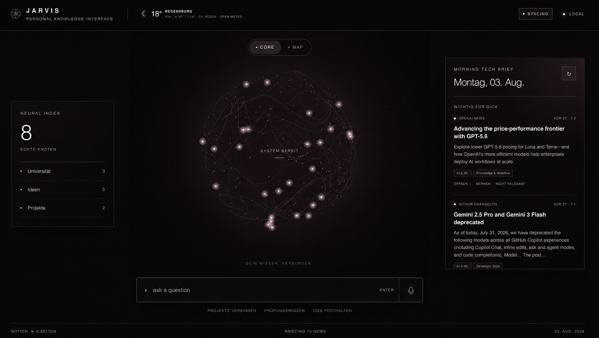

# JARVIS — Personal Knowledge Interface

[](https://github.com/Sissighn/jarvis-knowledge-interface/actions/workflows/ci.yml)
[](https://nextjs.org/)
[](https://www.typescriptlang.org/)
[](https://nodejs.org/)
[](https://ollama.com/library/qwen3.5)
[](https://github.com/ggml-org/whisper.cpp)
[](https://v2.tauri.app/)
[](./LICENSE)


A local-first dashboard that turns selected Notion content into an interactive knowledge graph and combines it with grounded answers, focused tech news, weather, and private on-device voice input.



## Why JARVIS

JARVIS is designed to reduce information friction without creating another system to maintain. Notion remains the source of truth. The application reads only explicitly shared content, derives relationships locally, and brings the most useful context into one calm interface. No paid AI API is required for its current capabilities.

## Features

- animated, pointer-controlled neural core rendered with Canvas 2D
- interactive map generated from selected Notion pages and data sources
- hierarchy, relation, mention, and semantic-similarity graph edges
- local TF-IDF retrieval and cosine-similarity ranking
- deterministic topic clustering and collision-aware graph layout
- retrieval-augmented local Q&A with citations and explicit uncertainty
- natural German answers generated by Qwen 3.5 4B through Ollama
- deterministic extractive fallback when the local model is unavailable
- relevance-ranked daily tech briefing from multiple public sources
- local story bookmarks, relevance feedback, and daily browser cache
- current weather and four-day forecast from Open-Meteo
- manual-stop audio recording and editable local Whisper transcription
- native Apple Silicon app bundle powered by Tauri 2
- menu bar controls, launch at login, native notifications, and a global `⌘⇧J` shortcut
- focused small-screen layout that prioritizes the core and knowledge map
- read-only Notion access with server-only credentials

## Architecture

The application follows a feature-oriented structure. UI, domain types, server integrations, and pure algorithms are separated so each module has one clear responsibility.

```text
app/                         Next.js routes and API boundaries
config/                      build integration
features/
  ai/                        local Ollama client, API bridge, and answer contracts
  briefing/                  news aggregation, ranking, and types
  interface/                 components, hooks, renderers, and styles
  knowledge/                 Notion connector, retrieval, grounded answers, and graph algorithms
  speech/                    local whisper.cpp status and transcription bridge
  weather/                   Open-Meteo client and types
tests/
  unit/                      deterministic domain tests
  integration/               built-worker and security-boundary tests
scripts/                     local development and speech-model setup
desktop/                     packaged loopback server adapter
src-tauri/                   native macOS shell, tray, shortcut, and app lifecycle
worker/                      Cloudflare/vinext runtime entry point
```

See [Architecture](./docs/ARCHITECTURE.md) for the data flows and design decisions.

## Getting started

### Requirements

- macOS on Apple Silicon is the primary supported local environment
- Node.js 22.13 or newer
- npm
- Homebrew
- [Ollama](https://ollama.com/) for natural local answers
- `whisper-cpp` and `ffmpeg` for high-quality local speech-to-text
- an optional Notion internal integration for real workspace data

### Installation

```bash
git clone git@github.com:Sissighn/jarvis-knowledge-interface.git
cd jarvis-knowledge-interface
npm install
cp .env.local.example .env.local
ollama pull qwen3.5:4b
brew install whisper-cpp ffmpeg
npm run setup:speech
npm run dev
```

Open the local URL printed by the development server. Without Notion credentials, JARVIS starts with a small built-in sample graph.

Ollama runs the answer model on the same Mac, so no paid model API or API key is needed. Without Ollama, search and the extractive fallback remain available.

`npm run dev` starts both the web interface and the local Whisper service. Voice recordings continue until the user presses Stop. JARVIS then transcribes the complete recording locally, places the editable text in the command box, and sends nothing until Enter or the send button is used.

The downloaded model files use approximately 4 GB in total: about 3.4 GB for Qwen and 574 MB for Whisper, excluding the runtimes and package dependencies. Both models are excluded from Git.

## Native macOS app

The Tauri app packages the existing server-rendered interface behind a loopback-only sidecar. Secrets and model excerpts stay behind the same server boundary as in local web development; native code owns the application lifecycle and macOS integrations.

Install the Rust toolchain once, then build the Apple Silicon app:

```bash
brew install rustup
$(brew --prefix rustup)/bin/rustup default stable
npm run desktop:build
```

The build creates:

```text
src-tauri/target.noindex/release/bundle/macos/JARVIS.app
src-tauri/target.noindex/release/bundle/dmg/JARVIS_0.1.0_aarch64.dmg
```

For normal daily use, open the installed `JARVIS.app` from Spotlight, Launchpad, or the Applications folder. No terminal or npm command is required. A packaged app is a fixed snapshot: source changes are not copied into the installed app automatically.

Use this workflow while developing:

1. Quit the installed JARVIS app so it does not occupy the local desktop port.
2. Run `npm run desktop:dev` for a native development window with live frontend updates.
3. Edit and test the application.
4. Run `npm run check` before packaging a new version.
5. Run `npm run desktop:build`, then replace the older app in Applications with the newly generated `JARVIS.app` or install it from the DMG.

JARVIS does not currently include an automatic updater. That is intentional for the local development phase; signed update delivery can be added once versioning, Developer ID signing, and release publishing are established.

Local builds are ad-hoc signed and pass macOS code-signature verification. Public distribution to other Macs requires an Apple Developer ID certificate and notarization; those private credentials are intentionally not part of the repository.

`desktop:build` securely copies `.env.local` with owner-only permissions and prepares the ignored Whisper model under `~/Library/Application Support/com.sissighn.jarvis/`. It does not embed credentials or personal Notion content in the app or DMG.

Native behavior:

- `⌘⇧J` shows or hides JARVIS from anywhere on the Mac
- closing the window keeps JARVIS available from the menu bar
- the menu bar can open or fully quit the app and toggle **Beim Anmelden öffnen**
- release builds enable launch at login on first start
- macOS asks for notification permission before the first Morning Brief notification
- the packaged server binds only to `127.0.0.1`; Ollama and Whisper remain local services

Use `npm run desktop:dev` while developing the native shell. The first native build compiles Rust dependencies and therefore takes longer than later builds.

## Configure the local model

JARVIS defaults to Qwen 3.5 4B, a compact model suitable for the local setup. Keep Ollama running and configure another installed model only if needed:

```dotenv
OLLAMA_BASE_URL=http://127.0.0.1:11434
OLLAMA_MODEL=qwen3.5:4b
```

For each question, the browser retrieves at most five relevant notes. Only those excerpts are sent to the Ollama process on the same device. The model is instructed to answer exclusively from this context and to return numbered citations.

## Configure local speech-to-text

JARVIS records audio with the browser `MediaRecorder` API and sends the finished in-memory recording only to the local whisper.cpp service. The default model is the multilingual `large-v3-turbo-q5_0` variant, optimized for a practical balance of accuracy, speed, and memory usage on Apple Silicon.

```dotenv
WHISPER_BASE_URL=http://127.0.0.1:8178
WHISPER_PORT=8178
WHISPER_MODEL_PATH=models/whisper/ggml-large-v3-turbo-q5_0.bin
WHISPER_LANGUAGE=de
```

`WHISPER_PORT` controls the local service and must match the port in `WHISPER_BASE_URL`. The language defaults to German while retaining recognition of English technical terms through a domain-specific prompt. Set `WHISPER_LANGUAGE=auto` if the complete recording may use another primary language.

Voice workflow:

1. Press the microphone button to begin recording.
2. Speak for as long as needed; silence does not submit or intentionally stop the session.
3. Press **Stop** to end the recording and start local transcription.
4. Review and edit the transcript in the command box.
5. Press Enter or the send icon to submit it as a question.

Audio is not submitted as a question automatically. If transcription fails, the error remains visible and no text is sent to the answer model.

## Connect Notion safely

1. Create an internal Notion integration with read-content access only.
2. Share only the pages or data sources JARVIS may read with that integration.
3. Add the token to the ignored `.env.local` file.
4. Restart the development server.

```dotenv
NOTION_ACCESS_TOKEN=secret_your_internal_notion_token
NOTION_MAX_PAGES=80
NOTION_CONTENT_SCAN_LIMIT=40
```

The token is consumed only by server routes. It is never embedded in the browser bundle or stored in the repository.

## Configure weather

Weather uses [Open-Meteo](https://open-meteo.com/) and requires no API key for this personal setup. Berlin is the default. Override it in `.env.local`:

```dotenv
WEATHER_LOCATION_NAME=Regensburg
WEATHER_LATITUDE=49.0134
WEATHER_LONGITUDE=12.1016
```

## Data sources and local processing

| Capability | Source | Processing |
| --- | --- | --- |
| Knowledge graph | Notion API | server-side parsing; local TF-IDF, clustering, and layout |
| Knowledge Q&A | loaded graph + local Ollama | TF-IDF retrieval, Qwen answer generation, citations, and extractive fallback |
| Tech briefing | OpenAI News, GitHub Changelog, Techpresso, Hacker News | server-side aggregation, scoring, and deduplication |
| Weather | Open-Meteo | server-side fetch with a 30-minute memory cache |
| Voice input | microphone + local whisper.cpp | MediaRecorder capture, local large-v3-turbo transcription, manual review before sending |
| Preferences | browser storage | stays on the current device |

Techpresso is an optional source because its public archive endpoint is undocumented. If it changes or becomes unavailable, the other sources and the last daily browser cache continue to work.

## Quality checks

```bash
npm run lint
npm run typecheck
npm run test:unit
npm run test:integration
npm run desktop:check
npm run check
```

`npm run check` executes the complete local web-quality pipeline. Integration tests build the application, verify server-rendered output, exercise the disconnected Notion state, and confirm that credentials remain behind the server boundary. GitHub Actions additionally builds the desktop sidecar and runs Rust formatting plus Tauri compilation checks on an Apple Silicon macOS runner.

## Useful commands

| Command | Purpose |
| --- | --- |
| `npm run dev` | start the web interface and local Whisper service together |
| `npm run dev:web` | start only the web interface |
| `npm run dev:speech` | start only the local Whisper service |
| `npm run setup:speech` | download or verify the ignored 574 MB speech model |
| `npm run desktop:dev` | run JARVIS inside the native Tauri development window |
| `npm run desktop:setup` | prepare private desktop configuration and the local speech model |
| `npm run desktop:check` | format-check and compile-check the native Rust shell |
| `npm run desktop:build` | create the Apple Silicon `.app` and `.dmg` bundles |
| `npm run check` | run linting, type checks, unit tests, integration tests, and the production build |

## Troubleshooting

- **Microphone access denied:** allow microphone access for the local JARVIS URL in the browser, then reload the page.
- **Whisper is unavailable:** run `npm run setup:speech`, then restart with `npm run dev`.
- **Port 8178 is already in use:** stop the older Whisper process before restarting JARVIS, or configure a different local URL consistently.
- **Technical terms are misheard:** add important recurring vocabulary to the Whisper prompt in `scripts/start-whisper-server.mjs` and `features/speech/server/whisper.ts`.
- **The first start takes longer:** whisper.cpp loads the local model into unified memory before accepting transcription requests.

## Privacy and cost

- no paid AI API or hosted database is required
- Qwen runs through Ollama on the same device; retrieved excerpts do not leave the Mac
- voice recordings are sent only to the local whisper.cpp process and are not persisted by JARVIS
- the Notion token stays server-side and is excluded from Git
- Notion access is intentionally read-only
- saved and hidden stories remain on the current device
- individual feed failures do not break the entire briefing
- at most five retrieved note excerpts are passed only to the locally running model

The complete local data-flow and deletion guidance is documented in [Privacy](./PRIVACY.md). The source code is available under the [MIT License](./LICENSE); separately installed runtimes, model weights, packages, and external services keep their own terms, summarized in [Third-party notices](./THIRD_PARTY_NOTICES.md).

## Current scope

The command bar uses retrieval-augmented generation: deterministic local search selects the sources, then the local model turns them into a concise answer. It is explicitly instructed not to add outside knowledge. If context is missing or Ollama is offline, JARVIS reports uncertainty and falls back to the deterministic source view. JARVIS does not write to Notion.

The Qwen and Whisper capabilities are intentionally local runtime features. A hosted frontend or Worker cannot access models running on a personal Mac unless an explicit private connection is added; the supported workflow is currently `npm run dev` on the same device as Ollama and whisper.cpp.

## Technology

Next.js 16, React 19, TypeScript, Canvas 2D, Ollama, Qwen 3.5, whisper.cpp, Whisper large-v3-turbo, vinext, Cloudflare Workers, the Notion API, Open-Meteo, TF-IDF, and cosine similarity.

## License

Copyright © 2026 Setayesh (Sissighn). JARVIS source code is licensed under the [MIT License](./LICENSE).
